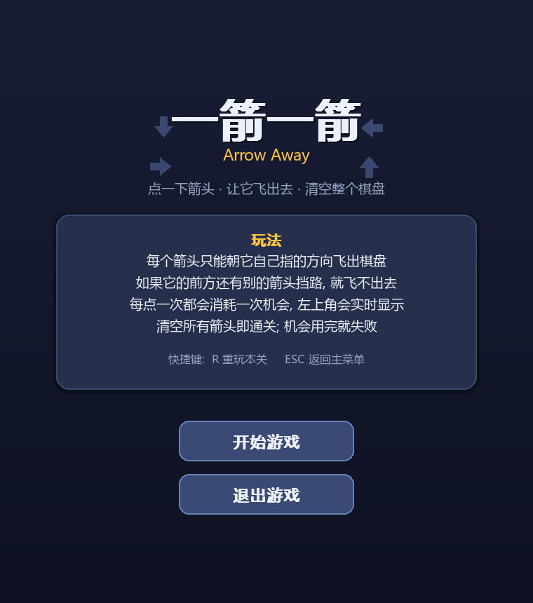
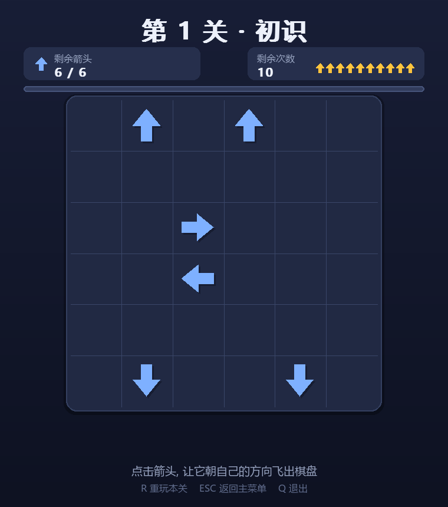
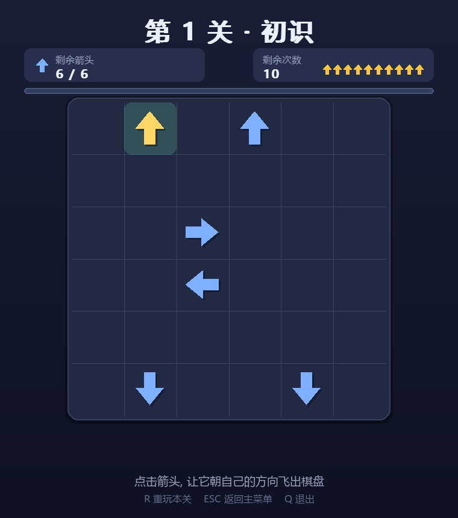
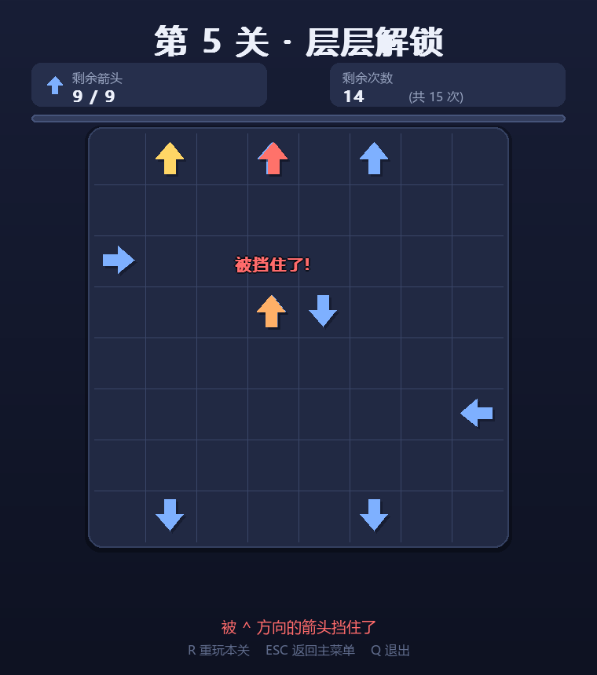
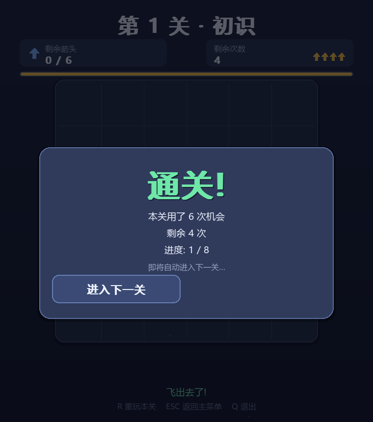
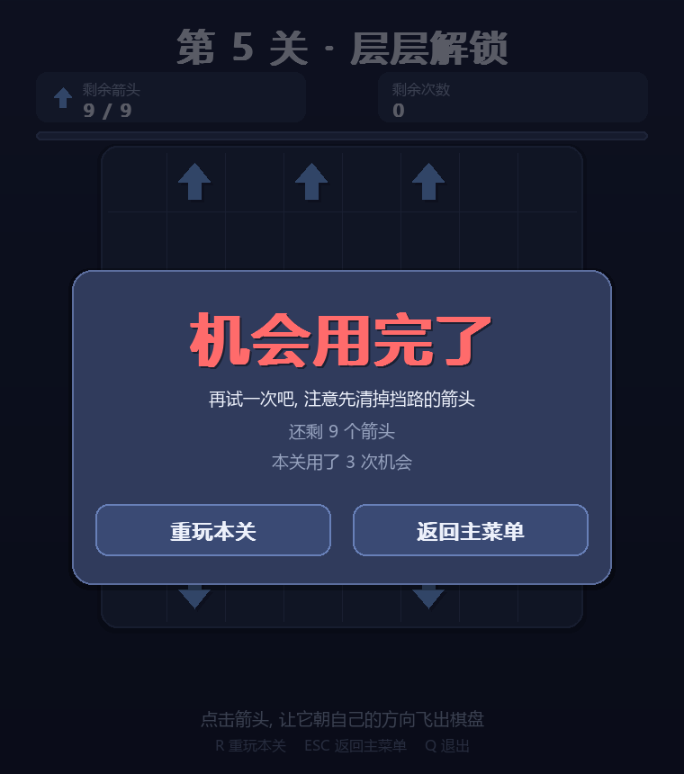
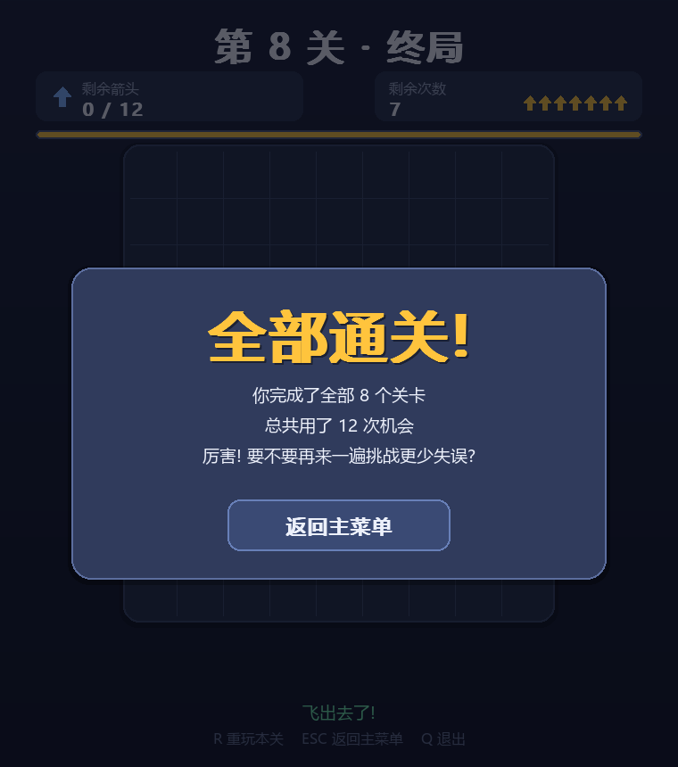
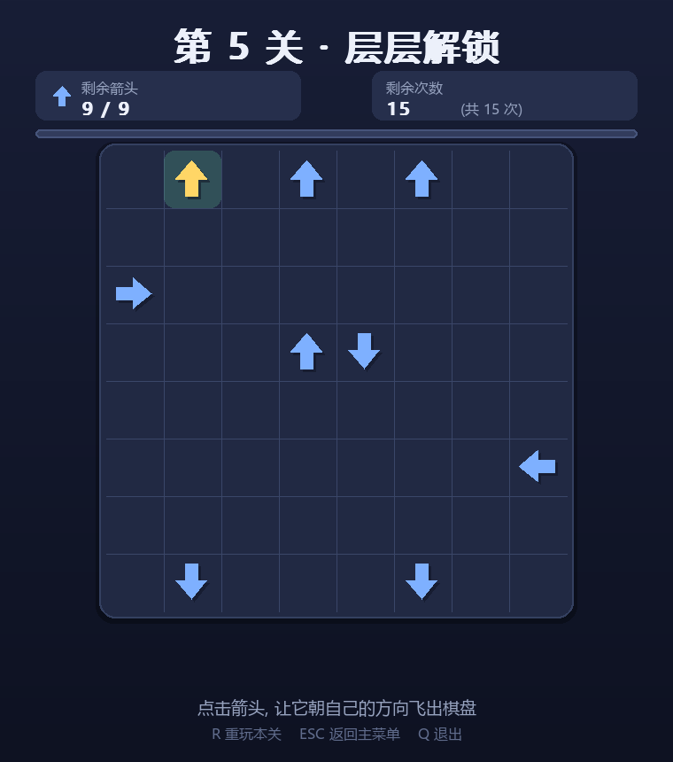

# 一箭一箭 · Arrow Away

> 福州大学 2026 秋《软件工程与实践》第二次个人作业
> 用 Python + Pygame 实现的一款「箭头消除」小游戏。
> 开发过程中使用 AIGC 工具辅助（记录见 [`docs/AIGC_LOG.md`](docs/AIGC_LOG.md)）。

---

## 1. 项目简介

棋盘上散布着若干个箭头，每个箭头只朝一个方向（上 / 下 / 左 / 右）。

**点一下箭头**，它就会朝自己指的方向飞出去；但如果它的前方还有别的箭头挡路，
它就飞不出去 —— 你要做的就是**按正确的顺序把挡路的箭头先清掉**，
用有限的机会把整个棋盘清空。

看似简单，但要一次不错地清空棋盘，需要先找出「谁挡住了谁」，
这就是这款小游戏的核心乐趣。

---

## 2. 游戏截图

| 开始界面 | 游戏界面 |
| --- | --- |
|  |  |

| 悬停提示（可以飞出） | 被挡住时的反馈 |
| --- | --- |
|  |  |

| 通关界面 | 失败界面 |
| --- | --- |
|  |  |

| 全部通关 | 更难关卡 |
| --- | --- |
|  |  |

---

## 3. 安装与运行方法

### 3.1 环境要求

* Python 3.10 及以上（开发环境为 Python 3.14）
* 依赖库：`pygame` 或 `pygame-ce`

### 3.2 安装依赖

```bash
pip install -r requirements.txt
```

> **提示**：如果你的 Python 版本较新（例如 3.13+），`pygame` 可能还没有对应的
> 预编译包。此时请改装 **`pygame-ce`**（社区维护版，用法与 `pygame` 完全一致，
> `import pygame` 不需要改动）：
>
> ```bash
> pip install pygame-ce
> ```
>
> 本项目在 Python 3.14 + pygame-ce 2.5.8 下开发与测试。

### 3.3 运行游戏

```bash
python main.py
```

### 3.4 运行测试

```bash
python -m unittest discover -s tests -v      # 全部自动化测试 (25 项)
python tools/check_levels.py                 # 关卡可通关性校验
python tools/run_tests.py                    # 跑测试并刷新 docs/TEST_RECORD.md
python tools/screenshot.py                   # 生成各界面截图 (无需显示器)
```

---

## 4. 游戏操作说明

| 操作 | 说明 |
| --- | --- |
| **鼠标左键点击箭头** | 让该箭头朝它自己的方向飞出棋盘 |
| **鼠标悬停** | 高亮箭头；绿色表示可以飞出，红色表示被挡住，并用绿点标出检查的路径 |
| **`R`** | 重新开始本关（棋盘与剩余次数都恢复初始状态） |
| **`ESC`** | 返回主菜单 |
| **`Q`** | 退出游戏 |
| **`Enter` / `空格`** | 在菜单/结果界面确认（开始游戏、进入下一关等） |

### 规则细节

1. 箭头只能朝**它自己指的方向**飞出，不能改方向。
2. 箭头朝向的**整条路径直到棋盘边缘**都不能有其他箭头。只要有一个箭头挡在
   中间，这次点击就**不会消除**那个箭头。
3. **每一次点击（成功或失败）都会消耗一次机会**，界面上会实时显示。
4. 点击**空格**不消耗机会（避免误操作惩罚过重）。
5. 清空全部箭头 → **通关**；机会用完还有箭头 → **失败**；
   如果剩下的箭头互相挡住、谁都飞不出去，也会判定为**失败**（"无路可走了"）。

### 界面元素

| 元素 | 位置 | 说明 |
| --- | --- | --- |
| 关卡名 | 顶部中间 | 当前关卡 |
| 剩余箭头 | 左上 | 已消除进度 `剩余 / 总数` |
| 剩余次数 | 右上 | 数字 + 箭头图标，直观显示还剩几次机会 |
| 进度条 | 关卡名下方 | 已消除箭头的比例 |
| 操作提示 | 底部 | 悬停/点击的实时反馈 |

---

## 5. 项目结构

```
yijian/
├── main.py                  # 程序入口
├── requirements.txt         # 依赖清单
├── README.md                # 本文件
├── core/                    # 核心逻辑 (不依赖 pygame, 可独立测试)
│   ├── board.py             #   棋盘、规则判定、点击处理
│   ├── solver.py            #   关卡求解与可通关性校验
│   └── levels.py            #   8 个关卡的定义与次数上限校验
├── ui/                      # 界面层 (pygame)
│   ├── theme.py             #   配色、字号、布局参数
│   ├── render.py            #   绘制工具 (字体/渐变/箭头/按钮)
│   ├── animations.py        #   动画 (飞出/抖动/飘字/粒子)
│   └── game.py              #   场景管理、输入处理、主循环
├── tests/                   # 测试
│   ├── test_core.py         #   规则单元测试 (T01~T11)
│   └── test_playthrough.py  #   全关卡通关 + 界面冒烟测试
├── tools/                   # 开发辅助脚本
│   ├── check_levels.py      #   关卡体检
│   ├── run_tests.py         #   跑测试并生成测试记录
│   └── screenshot.py        #   自动截图
└── docs/
    ├── AIGC_LOG.md          # AIGC 辅助开发记录
    └── TEST_RECORD.md       # 测试记录
```

### 设计说明

把**规则逻辑**（`core/`）与**界面表现**（`ui/`）分开是本项目最重要的一个设计决定：

* `core/` 完全不引用 pygame，因此可以被单元测试直接覆盖，也能在没有显示器的
  环境下运行；
* `ui/` 只负责把 `core/` 的状态画出来，并把鼠标点击翻译成 `board.click(row, col)`；
* 好处是「先清路再飞」这类规则 bug 可以在毫秒级的单元测试里被发现，
  而不需要开着窗口一遍遍手点。

---

## 6. 关卡设计

共 8 个关卡，难度递增。**每一关都经过求解器校验，保证可以通关**，
并且都留有一定容错次数（允许少量失误）。

| 关卡 | 棋盘 | 箭头数 | 最少步数 | 次数上限 | 容错 |
| --- | --- | --- | --- | --- | --- |
| 第 1 关 · 初识 | 6×6 | 6 | 6 | 10 | 4 |
| 第 2 关 · 依次解锁 | 6×6 | 6 | 6 | 10 | 4 |
| 第 3 关 · 十字 | 6×6 | 4 | 4 | 8 | 4 |
| 第 4 关 · 交错 | 6×6 | 4 | 4 | 9 | 5 |
| 第 5 关 · 层层解锁 | 8×8 | 9 | 9 | 15 | 6 |
| 第 6 关 · 上下夹击 | 8×8 | 8 | 8 | 14 | 6 |
| 第 7 关 · 合围 | 9×8 | 8 | 8 | 15 | 7 |
| 第 8 关 · 终局 | 10×9 | 12 | 12 | 19 | 7 |

### 如何保证"每个关卡都能通关"

这是本作业里最需要认真处理的一点。关卡用字符画描述：

```python
"""
.^.^..
......
..>...
..<...
......
.v..v.
"""
```

`. ` 是空格子，`^v<>` 是箭头。设计完一关后，用 `core/solver.py` 里的
**精确求解器**（记忆化深度优先搜索所有消除顺序）计算最少步数，
再由 `ensure_move_limits()` 把次数上限设为 `最少步数 + 容错次数`。
任何不可解的布局都会被 `tools/check_levels.py` 直接报错。

> **设计关卡时踩过的坑**：最初有一版关卡里，`>` 和 `<` 被放在同一行面对面，
> `^` 和 `v` 放在同一列面对面 —— 结果这两组箭头**永远互相挡住，谁也飞不出去**，
> 6 个关卡里有 6 个不可解。原因可以从规则直接推出：把箭头 A 移走只会让别的
> 箭头路径**变短**，绝不会变长；所以 A 一旦挡住 B，在 A 消失前 B 永远出不去，
> 互相挡住就是硬死锁。详见 [`docs/AIGC_LOG.md`](docs/AIGC_LOG.md) 案例 2。

---

## 7. 更新日志

| 版本 | 内容 |
| --- | --- |
| v1.0 | 完成基础玩法、8 个可通关关卡、四个界面、动画反馈、25 项自动化测试 |

---

## 8. 第三方资源声明

* 本项目**全部代码**为原创；图形界面中的箭头、按钮、图标均由 pygame 的绘图
  API 实时绘制（`ui/render.py`），**未使用任何外部图片素材**。
* 使用的字体为操作系统自带的中文字体（Windows 下优先使用「微软雅黑」
  `msyh.ttc`），未随项目分发任何字体文件。
* 依赖库：`pygame-ce`（LGPL v2.1）。项目未使用任何游戏素材、音乐或音效文件。
* 未使用任何受版权保护的原有游戏代码、美术素材、字体或音乐。
